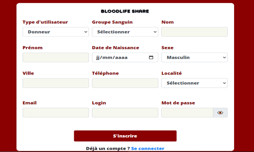
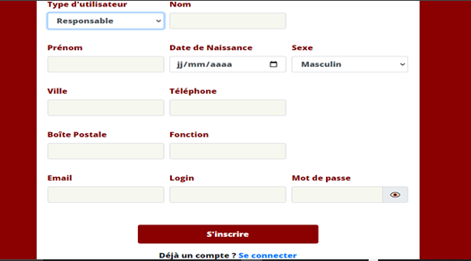
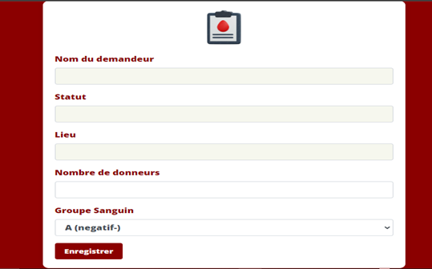
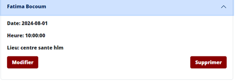
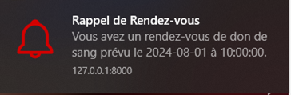
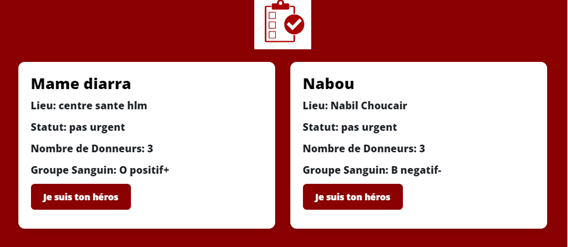
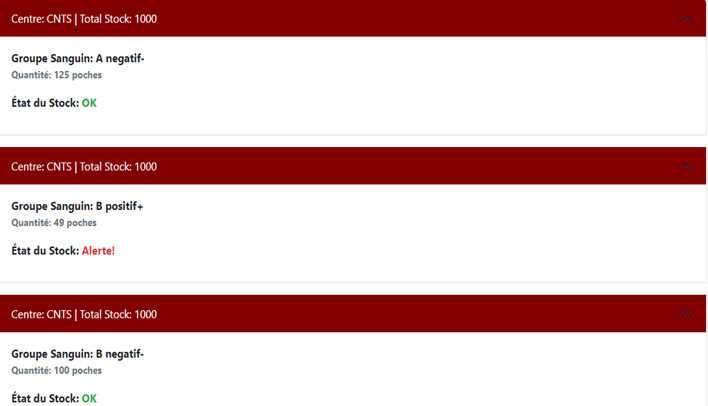

# 🩸 Projet Don de Sang

## 📌 Description
Développement d’une application web permettant la gestion des demandes de dons
Mise en place d’un système d’inscription et d’authentification
Gestion des rendez-vous entre donneurs et centres
Gestion de stock dans le Banque de sang

## ⚙️ Technologies
- Laravel
- PHP
- MySQL
- HTML / CSS

## 📸 Captures d’écran

### Page de connexion

👉 Permet aux utilisateurs de se connecter

### Page d'inscription

👉 Permet aux donneurs de s'inscrire

### Page d'inscription

👉 Permet aux responsables de s'inscrire

### Interface Demande de dons

👉 permet aux utilisateurs de faire des demandes de dons

### Interface de prise de Rendez-Vous

👉 permet aux donneurs de prendre des Rendez-Vous

### Interface de CRUD rendez-vous

👉 permet aux donneurs de modifier ou de supprimer un rendez-vous

### Interface de rappel de rendez-vous

👉 permet de rappeler les rendez-vous aux donneurs avant le jour

### Liste des Demandes de Dons

👉 affiche la liste de toutes les demandes de dons faites

### Interface de stock de sang

👉 affiche la liste de toutes les demandes de dons faites

## 🔗 Lien GitHub: https://github.com/Kiittyg/Blood-Life-Share/tree/main/examen
